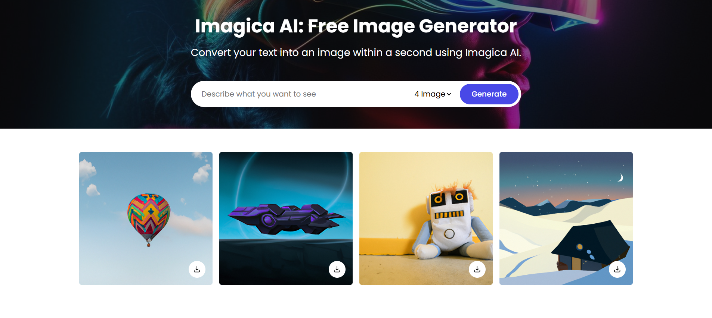
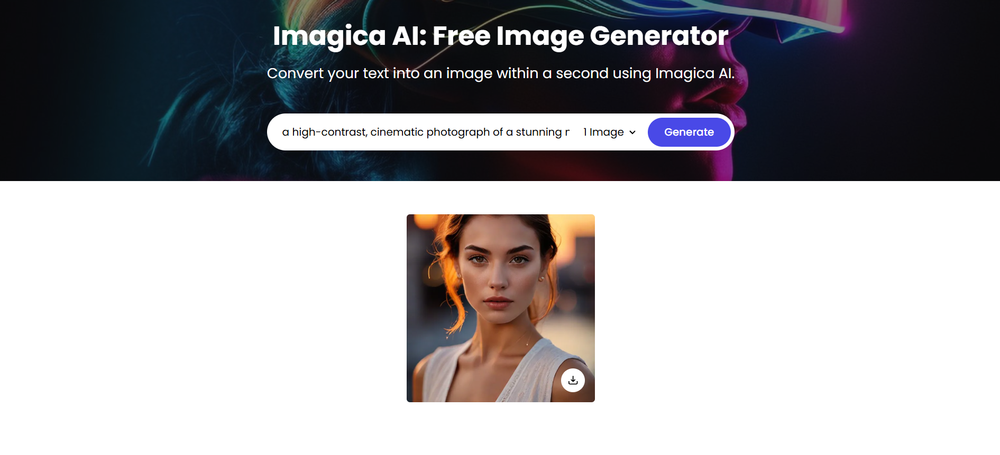
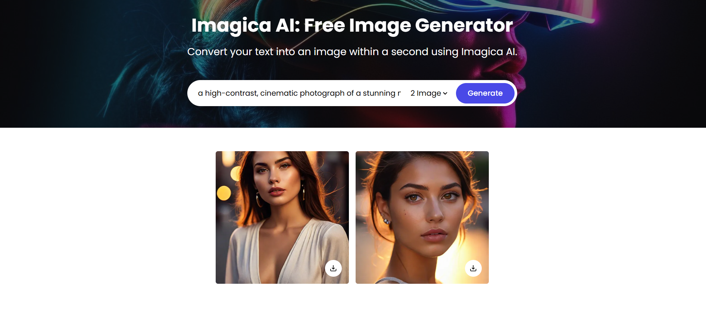
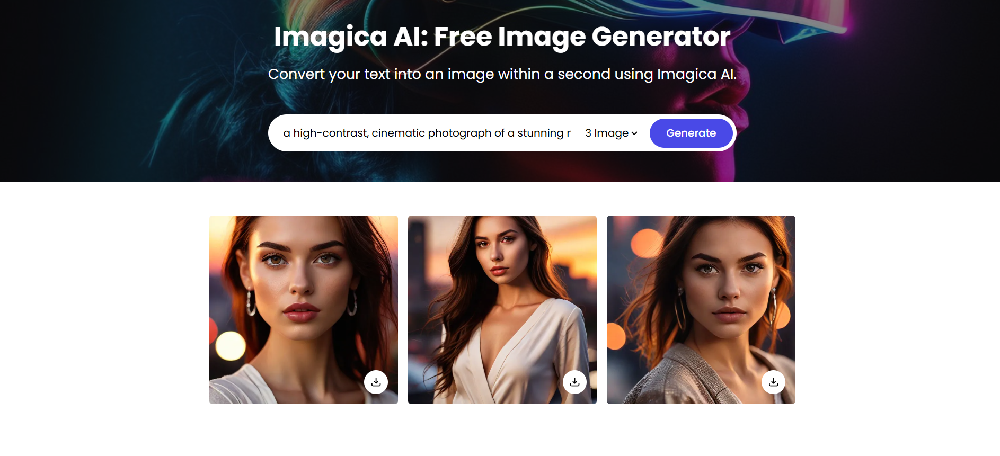
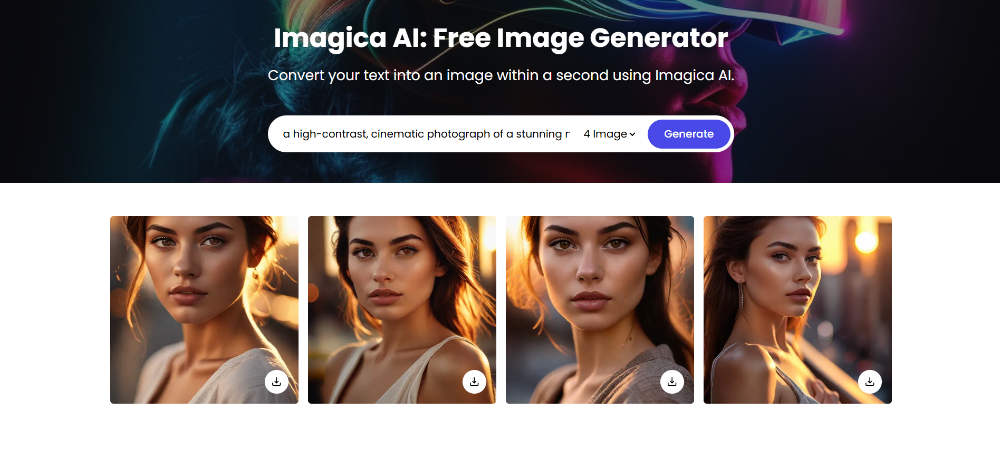

# <i>
# Imagica AI
# Description:
<i>Create stunning images for free, with no logins or subscriptions required.

A simple and powerful AI image generation tool powered by [insert AI model/tech here] that allows you to generate high-quality images directly from text prompts. This tool is completely free to use and open-source, designed to make AI-driven creativity accessible to everyone.

Key Features:

• No login required – Just visit the website and start generating!

• Completely Free – No hidden fees, subscriptions, or paywalls.

• Open Source – Contribute to the project, or deploy it yourself.

• Fast and Easy – Create images with just a few clicks.

# Links: 
<b>Imagica AI: [Live Demo](https://imagicaai.netlify.app/)

# Screenshots:

